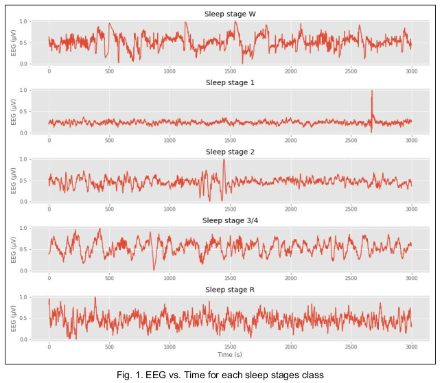

# Sleep Stages Classification using Spectrograms and Time Series Analysis of EEG signals.

Deep learning is seldom used in the classification of electroencephalography (EEG) signals, despite achieving state of the art classification accuracies in other spatial and time series data. Instead, most research has continued to use manual feature extraction followed by a traditional classifier, such as SVMs or logistic regression. This is largely due to the low number of samples per experiment, high-dimensional nature of the data, and the difficulty in finding appropriate deep learning architectures for classification of EEG signals.

Thus, our study aims at making use of Deep Learning architectures for the classification of brain signals or EEG. To prove that classification of brain waves can also be done using deep learning architecture, we have chosen a dataset consisting of sleep patterns of a certain number of subjects and tried to classify the sleep stages depending on the EEG signals of the subjects.

- [Project Report](https://drive.google.com/file/d/17xVccWE6RojCgX83xdhpA0JFImTLbs7w/view?usp=sharing)
